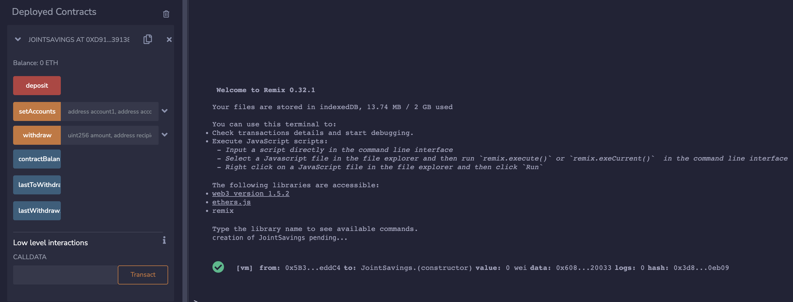
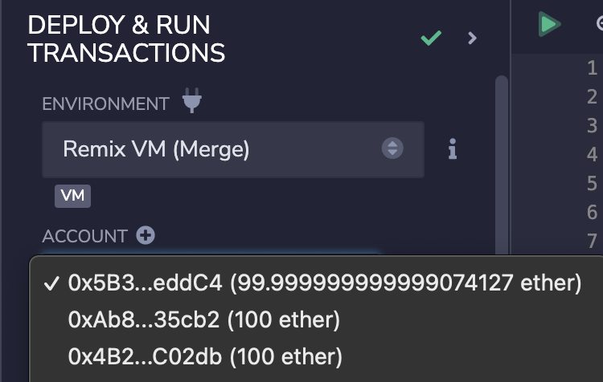
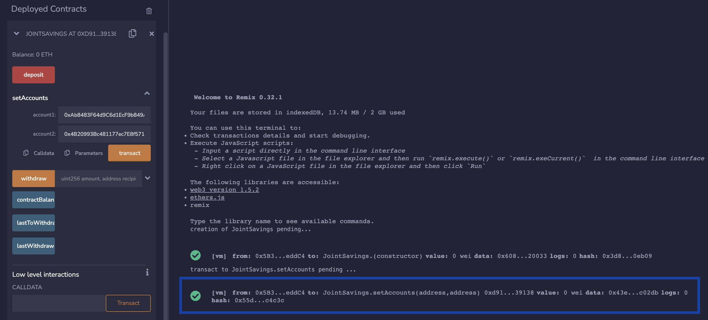
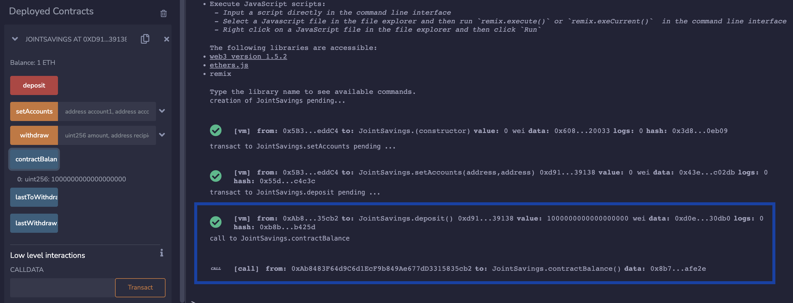
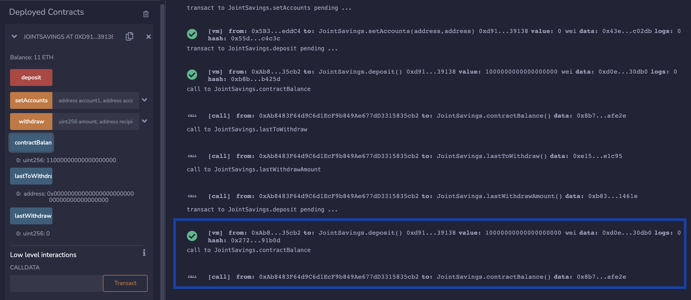
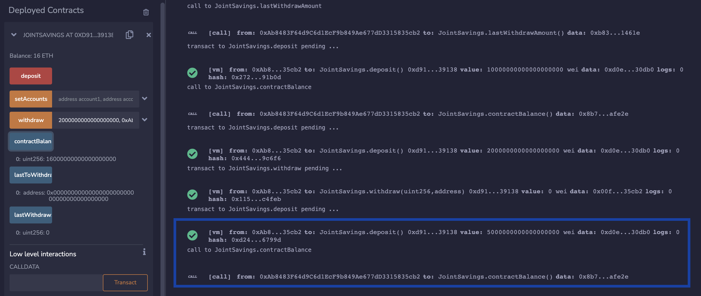
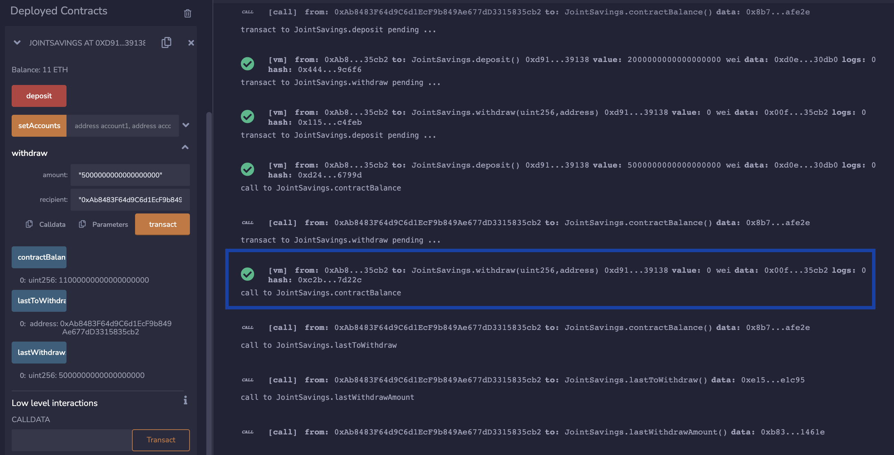

# Example Deployment & Execution Results

## Deployment

[Remix IDE](remix.ethereum.org)

Remix VM (Merge)

## Example 

### 1. Deploy Contract

### 2. ETH Wallets

### 3. setAccounts

### 4. Deposit 1 ETH 

### 5. Deposit 10 ETH 

### 6. Deposit 5 ETH

### 7. Withdraw 5 ETH

### 8. Withdraw 10 ETH

